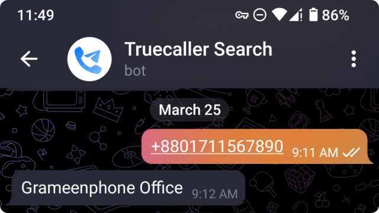

# 📞Truecaller Search Bot

A Telegram bot that uses an unofficial Truecaller API to look up phone number information instantly. It's an alternative for occasional use of Truecaller than running their app in background all the time.

<br>
<div align="center"><br>This bot is based on the <a href="https://github.com/sumithemmadi/truecallerjs">sumithemmadi/truecallerjs</a> library and is live at <a href="https://t.me/truecallerjs_bot">@truecallerjs_bot</a></div>

## Self-host

This is a Deno project currently deployed on Deno Deploy. It uses Deno KV which requires you to [join the waitlist](https://dash.deno.com/kv) first before you get access to it.

### Setup Telegram Bot

1. Create a new bot using [@BotFather](https://t.me/BotFather).
2. Set the bot commands:

   ```plaintext
   login - Login to Truecaller
   installation_id - Login via existing token
   logout - Logout from Truecaller
   info - Information about the bot
   ```

3. [Set the webhook URL](https://core.telegram.org/bots/api#setwebhook) after deploying the bot using the following procedure.

### Deno Deploy

1. [Fork](/../../fork) this repo on GitHub.
2. Create a [new Deno Deploy](https://dash.deno.com/new) project from the forked repo.
3. Go to the project's `Settings` tab and add the Environment Variables from [.env.example](.env.example) file. You can skip adding the optional envs as they aren't critical to the service.
4. Grab the deployment URL from the `Overview` tab and set the webhook mentioned in previous section.

## Information

**Author:** [Nissan Ahmed](https://anissan.com) ([@ni554n](https://twitter.com/ni554n))

**Donate:** [PayPal](https://paypal.me/ni554n)

